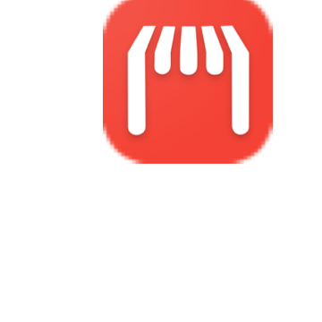

# Abdulrahman Bawazir 👋

### Flutter Developer | Former Web Developer | App Publisher

Flutter developer with hands-on experience building and publishing real-world apps across finance, e-commerce, booking, and educational use cases. I focus on practical products, clean UI, store-ready delivery, and reliable integrations.

🌐 Website: [www.bakrin.com](https://www.bakrin.com)

---

## 👨‍💻 About Me

I started as a web developer in 2016, working with `PHP`, `MySQL`, `Bootstrap`, `jQuery`, and `Vue.js`, then transitioned into Flutter development in 2019. Since then, I have built and shipped multiple applications for `Android` and `iOS`, including finance tools, offers platforms, booking apps, and Quran learning apps. My work includes UI design, application development, store publishing, API integration, and day-to-day product iteration.

---

## 🎓 Education

- Self-taught developer with continuous practical learning through real client work, self-study, experimentation, and publishing production apps.

---

## 🛠 Skills

### Mobile
- `Flutter`
- `Dart`
- `Android`
- `iOS`
- `REST API`
- `Firebase`
- `sqflite`
- `GetX`
- `RevenueCat`
- `AdMob`

### Web
- `PHP`
- `MySQL`
- `Vue.js`
- `jQuery`
- `Bootstrap`

### Tools & Workflow
- `Git`
- `GitHub`
- `Google Play Console`
- `App Store Connect`
- `Android Studio`
- `VS Code`

---

## 🚀 Projects

### 1.  Muamalat
Personal accounting app for managing expenses, debts, and recurring transactions with support for multiple wallets, currencies, and backup workflows.  
**Tech:** `Flutter`, `sqflite`, `Android`  
**App Link:** [Google Play](https://play.google.com/store/apps/details?id=com.bakrin.muamalat.expenses.income.debts.muamalat)

  
  
  
  

### 2.  Eurud
Offers comparison app that helps users compare store prices, build shopping lists, and browse product offers through connected APIs and authentication flows.  
**Tech:** `Flutter`, `REST API`, `Android`, `iOS`  
**GitHub:** [GitHub Profile](https://github.com/elBAKRIN)  
**App Link:** [Google Play](https://play.google.com/store/apps/details?id=com.offer.eurud&hl=ar),  [App Store](https://apps.apple.com/sa/app/%D8%B9%D8%B1%D9%88%D8%B6-%D9%85%D9%82%D8%A7%D8%B1%D9%86%D8%A9-%D8%A3%D8%B3%D8%B9%D8%A7%D8%B1-%D9%88%D8%AA%D8%AE%D9%81%D9%8A%D8%B6%D8%A7%D8%AA/id6759877928)

  
  
  
  

### 3.  Hajzak
Booking app for trips, rest houses, and events, focused on interface design and Flutter UI implementation.  
**Tech:** `Flutter`, `Android`, `IOS`  
**App Link:** [Google Play](https://play.google.com/store/apps/details?id=com.supersend.hajzak)

  
  
  
  

### 4.  The Holy Quran Recitation & Memorization
Quran app for self-recitation practice, memorization support, and tafsir display, with API integration for audio and content delivery.  
**Tech:** `Flutter`, `REST API`, `Android`  
**App Link:** [Google Play](https://play.google.com/store/apps/details?id=com.bakrin.recite_the_holy_quran)

  
  
  
  

### 5.  Product Cost Calculator
An older Android app built to calculate product cost using different unit types such as item count, liters, milliliters, kilograms, and grams, with invoice support and profit calculation.  
**Tech:** `Flutter`, `REST API`, `Android`  
**App Link:** [Google Play](https://play.google.com/store/apps/details?id=com.calculate.productcost)

  
  
  
  

### Legacy Projects
<!-- 
### 5.  Product Cost Calculator
An older Android app built to calculate product cost using different unit types such as item count, liters, milliliters, kilograms, and grams, with invoice support and profit calculation.  
**Tech:** `Android`, `Business Logic`, `UI Design`  
**App Link:** [Google Play](https://play.google.com/store/apps/details?id=com.calculate.productcost) -->

### 6.  Bearo English
English learning app focused on reading, translated books, word tapping for instant meanings, and direct listening support. I handled the full app implementation along with logo and interface design.  
**Tech:** `Android`, `Educational App`, `UI Design`

### 7.  Platform App
Marketplace-style Android app for displaying stores and home businesses, browsing products, creating a shopping cart, and sending orders directly to the store. The implementation included UI work and Firebase integration.  
**Tech:** `Android`, `Firebase`, `E-commerce`, `UI Design`

---

## 📄 CV

Download my CV here: [Abdulrahman Bawazir CV (PDF)](./Abdulrahman-Bawazir-CV2.pdf)

---

## 📫 Contact

- **Email:** `graphic.pixels7@gmail.com`
- **Phone:** `+967739857879` / `+967775082906`
- **WhatsApp:** 1  / 2 
- **Website:** [www.bakrin.com](https://www.bakrin.com)
- **GitHub:** [github.com/elBAKRIN](https://github.com/elBAKRIN)
- **Location:** Yemen, Mukalla

---

## 🕵️‍♂️ Profile

**GitHub:** [GitHub Profile](https://github.com/elBAKRIN)  

<!-- ---

## 📊 GitHub Stats

 -->

---

## 👀 Visitors

